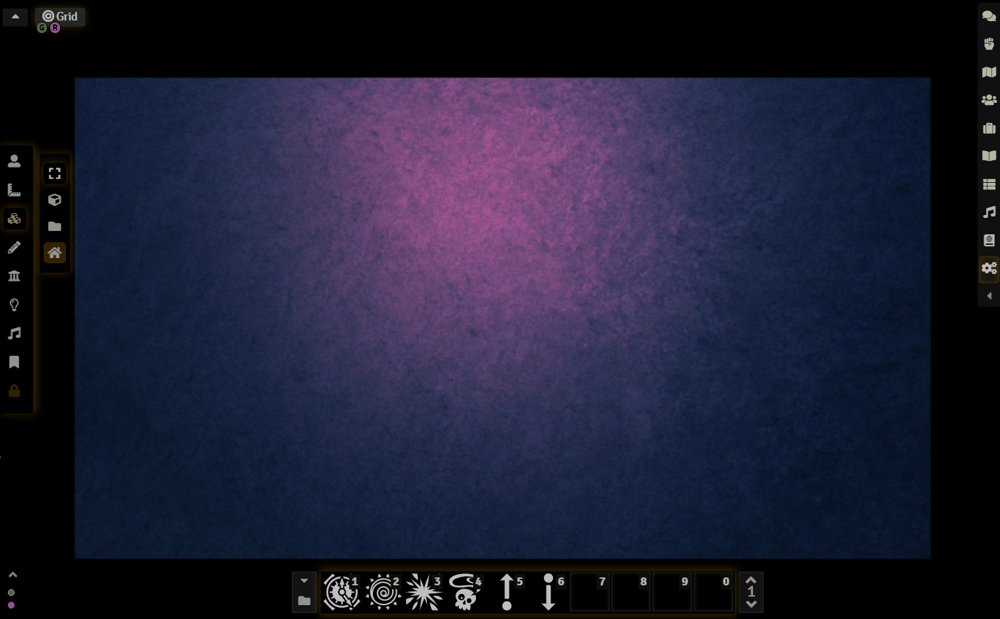
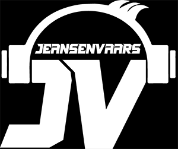

    
# JV's Clipboard Image for Foundry VTT

Allows copy-pasting images directly into Foundry VTT Tiles Layer.

### _Created by: JeansenVaars_ - [Invite me a coffee if you like this module :D](https://ko-fi.com/jeansenvaars)

### Usage

1. Copy an Image you like from any source (internet, file or a screenshot)
2. Go to Foundry, focus on the Canvas and Press CTRL+V
3. If an Image is found in your Clipboard, it will paste the image under your mouse and switch you to the Tiles layer.

### Servers without HTTPS or Domain
The browser won't trust your server for Clipboard access if you are running a server on an IP Address for example. Going to `about:flags` in your browser and trusting your server can be done here, before Image Clipboard works

### Firefox Support

Firefox Won't work by default. Version 90+ Disabled Clipboard API paste function. It won't work there unless you enable 
`dom.events.asyncClipboard.read` and `dom.events.testing.asyncClipboard` in `about:config` or use a Chromium based browser instead.

### Functionalities

1. Images uploaded to a folder called `pasted_images` by default. This can be configured per world in the settings. If
   you would like for example to store pasted images within your specific world, then you can
   set `worlds/<my-world>/pasted_images`
2. If an image is larger than Canvas dimensions, then the Tile (not image) will be pasted as 1/3 the size of the canvas,
   while holding image proportions.
3. Use CAPS LOCK to toggle between hidden or visible paste mode
4. Faster when using small images, keep it reasonable! (large images are not an issue but rather avoid problems with slow networks and bad internet)
5. If an object is already copied from Foundry, the paste will give priority to that object ONCE

## Recommended With

[Minimal UI](https://github.com/saif-ellafi/foundryvtt-minimal-ui)
and [Super Select](https://github.com/saif-ellafi/foundryvtt-super-select)

## Known Issues

If you are using **Chat Images** module, it may happen that pasting an image on the chat, if the chat panel is located somewhere
on top of the scene canvas, it might paste the image also on the scene. I could not yet find a solution for this, but
the circumstances are rare enough, it should not be an issue on a regula basis. This is due **Chat Image** disabling the focus on the chat,
when pasting, making me think that the mouse is prioritized on the scene instead of the chat.

## Appreciations

* @theripper93 for proposing a much better way of achieving this. Without his help this module would have struggled!
* @vttom for an amazing helpful attitude to get this module working properly in **The Forge**

## By JeansenVaars

## Check out my other modules!

* Minimal UI
* Scene Preview
* Super Select

# Appreciations

* Thanks to the FoundryVTT Discord community for the amazing issue reports and feedback.

# License

[MIT License](./LICENSE.md)

# Powered By

Thanks to JetBrains I can work on this project using **WebStorm**.
